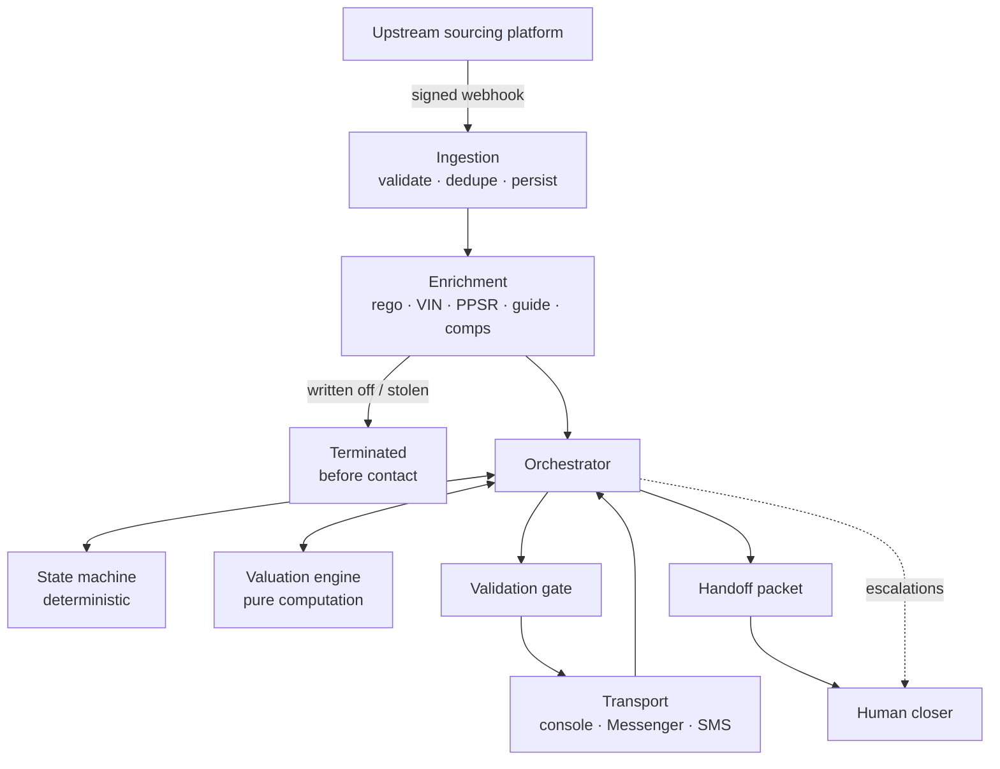
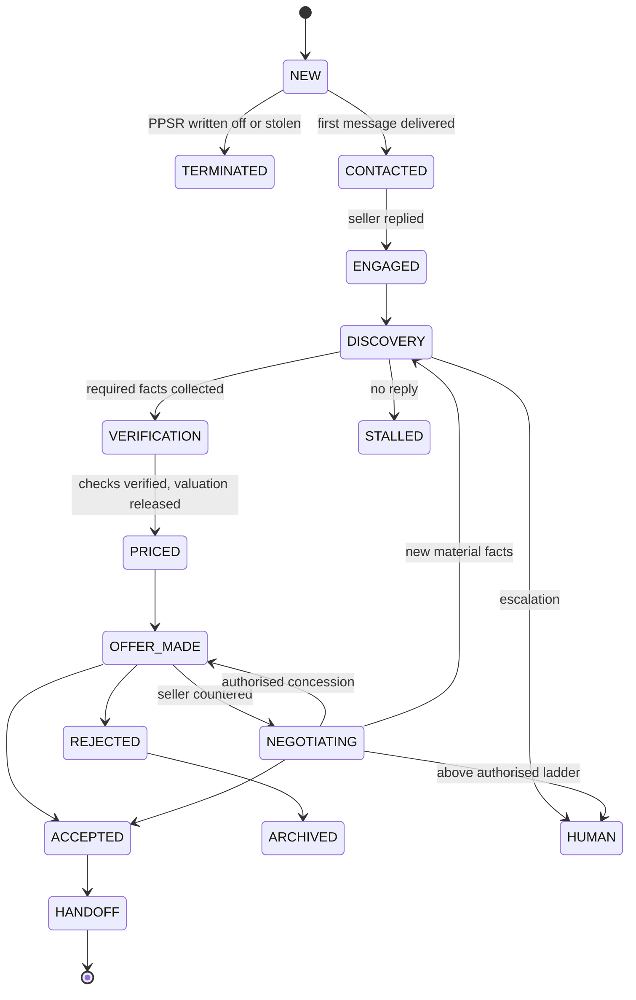

# acqbot — Wholesale Vehicle Acquisition Chatbot

Automated seller engagement and vehicle appraisal for wholesale acquisition. Consumes qualified
private-seller leads, conducts a structured discovery conversation, produces a bounded valuation,
presents a firm offer within pre-authorised limits, and hands a complete deal packet to a human
closer.

**Status** All six phases complete · 234 tests · Not production ready — see
[Before going live](#before-going-live)
**Stack** Python 3.11+ · FastAPI · PostgreSQL · SQLAlchemy 2 · Alembic · Claude API
**Jurisdiction** Victoria, Australia — LMCT-regulated activity

---

## Overview

A lead arrives from an upstream sourcing platform over a signed webhook. It is validated against a
strict versioned contract, deduplicated against the last ninety days, and enriched — registration
lookup, VIN decode, PPSR, trade guide, auction comparables — before any contact is attempted. A
written-off or stolen result ends the lead before a message is ever sent.

The conversation then collects the ten facts that gate pricing. Every claim the seller makes is
recorded as a claim, never as a fact; when a verified source later contradicts one, the lead
re-enters discovery and the contradiction is preserved for the closer. Once identity and the
statutory checks are verified, the valuation engine produces a ceiling and a four-step offer ladder.
The conversation may express those four figures and nothing else.

On acceptance, a handoff packet is written containing everything a salesperson would otherwise have
to re-ask: confirmed facts, unverified claims, contradictions, the PPSR result, the valuation with
its reconditioning line items and comparables, the agreed price, and the full transcript.

## How it works



| Subsystem | Responsibility | Module |
|---|---|---|
| Ingestion | Contract validation, deduplication, claimed-fact capture | `ingestion/` |
| Fact store | Append-only facts with supersession chains and contradiction detection | `facts/` |
| Enrichment | Provider-agnostic lookups; PPSR as a routing gate | `enrichment/` |
| Valuation engine | Base value, condition, reconditioning, ceiling, offer ladder | `valuation/` |
| State machine | Deal stage computed from collected facts | `conversation/state.py` |
| Validation gate | Every outbound message checked before it is sent | `conversation/gate.py` |
| Orchestrator | Per-message processing loop | `conversation/service.py` |
| Language model | Fact extraction and discovery replies, behind the gate; every call traced | `llm/`, `conversation/extract_model.py`, `conversation/compose.py` |
| Transport | Channel abstraction the orchestrator cannot see through | `transport/` |
| Queue | Durable Postgres-backed jobs with retry and backoff | `queue/` |

## Design invariants

Four properties hold everywhere, each enforced structurally rather than by convention.

**The language model never computes a price.** Every monetary value originates in the valuation
engine, a pure module with no network and no model access. The conversation receives four
authorised figures as data.

**The language model never decides the stage.** Deal stage is recomputed from the fact store on
every inbound message. A lead cannot reach an offer before the facts required to price it exist.

**No figure can be expressed that is not authorised.** The validation gate rejects any outbound
message containing a dollar amount before the `PRICED` stage, or any amount that is not one of the
four ladder values. When code is presenting a specific offer it narrows that further, to the one
amount being presented — being *on* the ladder is not enough — and pins the amount and the expiry
word for word. This is code at the send boundary, not an instruction in a prompt.

**Conversation evidence is immutable.** Messages, state transitions, valuations and market data
cannot be updated or deleted — enforced by database triggers, so the guarantee survives direct
access to the database. Fact supersession, offer outcomes and escalation resolutions are
write-once. A disputed transaction can be reconstructed exactly as it happened.

## The model in the loop

Two models with two jobs, neither of which is deciding anything. On every inbound message a small
model (Haiku) reads the seller's words and returns facts in a fixed format; code coerces each value
into the fact vocabulary or drops it, and the regex screens from Phase 3 still run underneath as a
floor — a legal threat the model misses is still caught. The state machine then recomputes the
stage from the fact store exactly as before.

The reply is planned by code: the planner decides what the next message *does* — ask for the
odometer, clarify a vague answer, raise a contradiction, ask for the remaining photos, say the
checks are running — and hands that instruction, with the scripted wording attached, to a stronger
model (Sonnet). The model writes it in its own words. The gate checks the draft; if it fails, the
violations go back to the model for one rewrite; if that fails too, the scripted wording is sent
instead. The model can neither block a conversation nor send an unchecked sentence.

What the model holds is deliberately narrow. Its context carries the stage, the outstanding
fields, the fact sheet split into verified / claimed / contradicted, the last fifteen turns
verbatim with older turns folded into a rolling summary, and the instruction for this turn.

Before `PRICED` it carries no figure at all — there is no code path that puts one there, so a
number it does not hold cannot be leaked. From `PRICED` it is handed exactly one: the amount code
has decided to present. Never the four ladder steps, never the ceiling, never the band, never what
the engine thinks the car is worth. A writer that knows the ceiling is a writer that can hint at
it, and a test asserts that at most one figure ever reaches a generation call.

So the model words discovery messages and offers. The opening, the disclosure, the "are you a bot?"
answer, the lapse notice and the closing lines stay scripted.

Every call is stored whole in `model_calls` — system prompt, messages, schema, response, tokens,
latency, error — under an immutable trigger, and every generated message records the model,
the prompt version and the hash of the exact prompt that produced it. `acqbot prompt <msg_id>`
reconstructs that prompt on demand.

```powershell
# .env:  ACQBOT_ANTHROPIC_API_KEY=sk-ant-...     (console.anthropic.com → API keys)
uv run acqbot model-check                          # verifies the key and both models with one tiny call each
uv run acqbot demo --model anthropic --seller accept
uv run acqbot chat --model anthropic               # you play the seller, the model writes the replies
uv run acqbot demo --model fake                    # the whole Phase 4 path with no network (tests use this)
uv run acqbot model-calls <lead_id>                # trace: purpose, model, tokens, latency, errors
uv run acqbot prompt <msg_id>                      # the exact prompt behind an outbound message
```

Without `ACQBOT_ANTHROPIC_API_KEY` the system runs on scripted templates exactly as in Phase 3.

## Reviewing the prompts

Tests decide whether the system is correct. They cannot decide whether it sounds like someone you
would sell a car to, and that judgement is what stands between this and a real inbox.

```powershell
uv run acqbot review --model anthropic     # ~90 calls, a few cents, writes review.md
                                           # (checks the key and the account balance first)
uv run acqbot review --model fake          # the same run with no network and no cost
uv run acqbot review --persona typos --persona vague
```

Fifteen sellers, none of them the cooperative one: the seller who answers four questions at once,
the one who hedges every answer, the one who types like a human on a phone, the one who asks a
question every turn, the one who wants a number before anything else, the one selling their mum's
car. Each declares what should be true at the end, so the run is scored rather than read.

The report leads with **every draft the gate refused, quoted in full**. That list is the point: a
gate rejection is the cheapest bug report a prompt can produce, because the bad message was stopped
before a seller saw it. Each one is either a prompt that needs a line or a gate rule that is too
tight, and it takes about a minute to tell which.

Then change the wording in `llm/prompts.py`, bump `PROMPT_VERSION`, and run it again. Personas
marked *needs a real model* are expected to fail on `--model fake` — the rule-based extractor
cannot read a typo or a hedge, and saying so is the point of the flag.

Three defects were found by writing the personas, before any model ran:
"it's my mum's car" did not trigger the not-the-owner screen, "Alright, done" was not read as
accepting an offer, and the gate rejected its own messages for saying "VIC" or "no hurry".

## Compliance posture

The system identifies itself as automated in its first message, names the dealership and licence
number, and answers a direct question about whether the seller is talking to a person with a
straight answer followed by a handover. It never references other buyers, competing offers, or
market competition that has not been supplied as verified data, and it never uses binding
commitment language — all three are gate rules, not guidance.

The forty-eight hour offer expiry is real: valuation inputs move, stock position changes, and the
offer is recorded with its expiry and expires on schedule.

An earlier design that simulated competing offers from multiple seller-facing accounts was
deliberately not implemented. See `docs/DECISIONS.md` (decision 1).

---

## Getting started

### Prerequisites

- Python 3.11 or later — or none, and let `uv` provide it
- [uv](https://docs.astral.sh/uv/) — `powershell -ExecutionPolicy ByPass -c "irm https://astral.sh/uv/install.ps1 | iex"`
- A PostgreSQL 14+ database. Supabase works as plain Postgres; no Docker required.

### Install

```powershell
uv sync        # runtime and dev tools (pytest, ruff) — dev tools are a uv dependency group
```

### Database

Take a connection string from your provider and adjust it in two ways: the scheme must be
`postgresql+pg8000://` (a pure-Python driver — no native DLL to be blocked; the earlier
`postgresql+psycopg://` scheme is accepted and rewritten), and `?sslmode=require` should
be appended for any hosted database.

On Supabase, use the **Session pooler** connection rather than the direct one. Direct connections
resolve over IPv6 only, which fails on IPv4-only networks with `getaddrinfo failed`. The session
pooler uses port 5432 and a username of the form `postgres.<project-ref>`. Do not use the
transaction pooler on port 6543 — it does not support the session features migrations require.

If the database password contains `@ # % / ?`, percent-encode it.

### Configure

```powershell
Copy-Item .env.example .env
```

At minimum set `ACQBOT_DATABASE_URL`, `ACQBOT_LEAD_WEBHOOK_SECRET` and `ACQBOT_ADMIN_TOKEN`.
Generate secrets with:

```powershell
uv run python -c "import secrets; print(secrets.token_urlsafe(48))"
```

### Initialise

```powershell
uv run acqbot migrate
```

This creates the schema and the append-only triggers. Verify the resolved connection at any time
without exposing the password:

```powershell
uv run python -c "from acqbot.config import get_settings as g; u=g().database_url; print(u.split('://')[0], '|', u.split('@')[-1])"
```

---

## Running

### Without any external services

Every external provider has a deterministic stub, so the whole pipeline runs offline against your
database alone.

```powershell
uv run acqbot demo --auto-offer      # scripted seller, full pipeline, prints the transcript
uv run acqbot chat                   # you play the seller
```

Scenarios: `clean`, `encumbered`, `written-off`, `stolen`, `contradiction`, `no-identifiers`,
`high-value`, `expired-rego`.
Seller scripts: `accept`, `negotiate`, `reject`, `bot_question`, `legal`, `silent_pushback`.

```powershell
uv run acqbot demo --scenario contradiction --seller accept --auto-offer
```

### Services

```powershell
uv run acqbot serve      # API on http://127.0.0.1:8000 — interactive docs at /docs
uv run acqbot worker     # job worker: enrichment, valuation, inbound messages, sends, expiries
```

### Lead intake and inspection

```powershell
uv run acqbot simulate-lead --count 5 --ingest --enrich          # direct to the database
uv run acqbot simulate-lead --count 3 --post http://127.0.0.1:8000/leads   # signed, as upstream will
uv run acqbot lead <lead_id>                                      # state, facts, market data, history
uv run acqbot value <lead_id>                                     # valuation with full working
uv run acqbot calibrate --csv historical_transactions.csv         # calibration report
uv run acqbot queue                                               # job counts by kind and status
```

### Human console

Two faces on the same code. `/console` is a screen for the sales floor; `/admin` is the same
actions as JSON. The console's POST handlers call the very same functions `/admin` exposes, so
there is one implementation of "present an offer" and the two cannot drift apart.

#### The screen — `/console`

```
uv run acqbot serve          # then open http://127.0.0.1:8000/console
```

Sign in with `ACQBOT_ADMIN_TOKEN`. Server-rendered HTML: no template engine, no npm, no second
system to host. Four pages:

| Page | What it is for |
|---|---|
| `/console` | Everything waiting on a person, oldest first, each with what happened and what to do about it. Rows carry whether the automation has stopped, the conversation has closed, or the bot is still talking. |
| `/console/leads/{id}` | One lead: the open task with its action, the ladder, offers, what is verified vs the seller's word, the transcript, and forms to resolve, present, record an outcome or record a fact. |
| `/console/handoffs` | Agreed deals awaiting a closer, with the Figure 5 packet in prose. Claim puts your name on it. |
| `/console/threads` | Conversations that could not be matched to a lead, with a form to link one. |

Reasons are written in words a person can act on: `human_requested` renders as **Asked for a
person — they were told they are talking to an assistant**, not as the raw string. The ladder
reads opening → first concession → second concession → ceiling, and the ceiling is drawn
differently because nothing automated ever offers it.

**Authentication** is a cookie holding an HMAC of the admin token, never the token itself, so the
cookie cannot be replayed into the `/admin` API and holding it does not reveal the secret.
`SameSite=Lax` stops another site POSTing here with your cookie attached, and the whole console
404s when `ACQBOT_ADMIN_TOKEN` is unset.

> **This is adequate for a back-office screen, not for the open internet.** One shared token, no
> per-user accounts, no audit of who signed in — only of who acted. Put it behind a VPN or an
> authenticating proxy before it is reachable from outside the dealership, and give it its own
> hostname so the public webhook endpoints are not on the same one.

#### The API — `/admin`

All endpoints under `/admin` require the `x-admin-token` header and are disabled entirely when
`ACQBOT_ADMIN_TOKEN` is unset.

| Endpoint | Purpose |
|---|---|
| `GET /admin/escalations` | Open work queue |
| `POST /admin/escalations/{id}/resolve` | Close an item; optionally return the lead to automation |
| `GET /admin/leads/{id}/transcript` | Full message history with template or model version and gate result |
| `GET /admin/leads/{id}/valuation` | Latest valuation with its complete input snapshot |
| `POST /admin/leads/{id}/facts` | Record a verified fact; triggers revaluation |
| `POST /admin/leads/{id}/present-offer` | Present a ladder step, or an above-ladder amount as a human decision |
| `POST /admin/leads/{id}/offer-outcome` | Record an outcome that happened off-channel |
| `GET /admin/handoffs` · `POST /admin/handoffs/{id}/claim` | Deal packets awaiting a closer |
| `GET /admin/threads/unlinked` · `POST /admin/threads/{id}/link` | Conversations that could not be matched to a lead |

### Messenger

Sellers reach the dealership Page through an `m.me/<page>?ref=<lead_id>` link, and the referral
webhook carries the lead id that links the conversation. Configure the webhook at
`/webhooks/messenger` with `ACQBOT_MESSENGER_VERIFY_TOKEN`, subscribing to `messages`,
`messaging_referrals` and `messaging_postbacks`.

The Messenger Platform cannot open a conversation with someone who has not messaged the Page
first, and outbound is limited to twenty-four hours after the seller's last message.

### Surviving that window

Somewhere in discovery the bot asks for a mobile number — once, framed as how the offer reaches
them, and never as a condition of anything. A seller who declines is still priced and still gets an
offer; the question is simply not asked again.

When the window does shut, a conversation with a number on file moves to SMS: a new thread on the
same lead, the same conversation logic, nothing above the transport layer any the wiser. Only when
there is genuinely nowhere to go — no number, or Twilio unconfigured — does it stop and ask a
person. The console marks the switch in the transcript so a closer can see which messages were
texts.

A seller who goes quiet gets three nudges: one at hour twenty, while Messenger will still carry it,
then one a day later and one three days after that. Each is short, adds nothing new, and offers an
easy way out. After the third, the bot says it will leave them alone and the lead goes to STALLED —
any reply picks it straight back up. It does not archive anything: the 90-day dedupe window means
an archived lead cannot simply be re-approached, and the re-engagement policy is still open.

The cadence numbers are `ACQBOT_NUDGE_BEFORE_WINDOW_CLOSES_HOURS`, `ACQBOT_SMS_NUDGE_HOURS` and
`ACQBOT_MAX_NUDGES`. Appendix A.2 leaves them to the dealership, so the defaults are a starting
position, not a recommendation.

Both webhooks verify, parse and enqueue; the worker runs the conversation loop. The webhook
therefore answers in milliseconds regardless of model latency, a redelivered event is deduplicated
by message id, and a reply that fails on the way out is retried without recording the seller's
message twice. Run one worker per deployment unless per-thread ordering is added to the queue.

---

## Conversation states



Stages in the main sequence are computed from the fact store on every message. Terminal and
human-owned states are set by events and are never recomputed.

---

## Project layout

```
src/acqbot/
  config.py              Settings (ACQBOT_* environment variables)
  models.py              Data model, job queue, handoff packets
  contracts/lead.py      Inbound lead contract, versioned and strict
  ingestion/             Signature verification, fingerprinting, ingest service
  facts/                 Field registry and the append-only fact store
  enrichment/            Provider protocols, deterministic stubs, enrichment pipeline
  valuation/             Engine (pure), service (persistence), calibration harness
  conversation/          State machine, extraction (rules + model), planner/composer, templates, gate,
                         orchestrator, history, handoff
  llm/                   Model client, prompts, output schemas and coercion, trace capture, fakes
  transport/             Transport protocol; console, Messenger, SMS
  queue/                 Postgres-backed job queue and worker
  api/                   Lead webhook, channel webhooks, admin console
  simulator.py           Lead generator standing in for the upstream platform
  demo.py                Scripted seller runs
  cli.py                 Command line
alembic/versions/        0001 schema and append-only triggers · 0002 handoff packets · 0003 model calls
docs/                    DECISIONS.md · PHASES.md
fixtures/                Synthetic calibration data
tests/
```

## Development

### Tests

The suite drops and recreates the schema on the database it is pointed at, and refuses to run
unless the database name contains `test`. Use a separate database — never one holding real leads.

```powershell
$env:ACQBOT_TEST_DATABASE_URL = "postgresql+pg8000://<user>:<password>@<host>:5432/postgres_test?sslmode=require"
uv run pytest
```

End-to-end tests drive scripted sellers through the complete pipeline over the console transport
and assert gate discipline on every outbound message — once on scripted templates and once through
the Phase 4 model path with a deterministic fake client. Two tests call the real Claude API and are
skipped unless `ACQBOT_ANTHROPIC_API_KEY` is set:

```powershell
$env:ACQBOT_ANTHROPIC_API_KEY = "sk-ant-..."
uv run pytest tests/test_live_model.py -v
```

### Migrations

```powershell
uv run alembic revision --autogenerate -m "description"
uv run acqbot migrate
uv run alembic check      # detect drift between models and schema
```

Downgrades are intentionally unsupported. Conversation data is never destroyed by a migration.

### Code style

```powershell
uv run ruff format src tests
uv run ruff check src tests
```

---

## Build status

| Phase | Scope | Status |
|---|---|---|
| 1 | Ingestion, data model, fact store | Complete |
| 2 | Valuation engine, offline | Built; **not calibrated** |
| 3 | State machine, scripted messages, transport | Complete |
| 4 | Language model for discovery | Complete; not yet run against a real seller |
| 5 | Automated offer presentation | Complete, behind `ACQBOT_AUTO_PRESENT_OFFER` |
| 6 | SMS transition and nudge sequences | Complete |

With `ACQBOT_AUTO_PRESENT_OFFER=false` (the default) a person presents every offer and every
counter routes to a person. The automation collects facts, verifies, prices and escalates.

With it `true`, the automation presents the opening and walks the two authorised concessions. It
stops there: the ceiling is a human decision, asked for as an approval with the figure already
worked out. The 48-hour expiry lapses for real — the seller is told, the lead goes to the queue,
and nothing re-offers on its own.

## Before going live

This system is not ready to contact a real seller. In order of lead time:

**The valuation engine has never seen a real price.** Trade guide, auction comparables, PPSR, VIN
decode and registration lookup are all deterministic stubs. The arithmetic is correct and tested;
the inputs are invented. Commercial agreements with a guide provider and an auction data source are
the longest lead items on the project.

**The calibration gate has not been passed.** The engine must be run against at least two hundred
historical transactions with known purchase price and actual reconditioning spend, and tuned until
the error distribution is acceptable. The harness exists and reports the right measures. The data
does not.

**The market-conditions term is inert.** `market_adj` is implemented but nothing populates days'
supply or current stock position, so it evaluates to zero. Slow-moving and fast-moving models are
currently priced identically.

**Statutory and platform access is outstanding.** PPSR access via AFSA or an accredited reseller;
Meta app review for `pages_messaging`, which requires business verification; an Australian mobile
number for two-way SMS.

**Configuration is still placeholder.** Dealership name, licence number, buyer identities, target
margin by segment, transport cost, high-value escalation threshold and the human response SLA.

**The prompts have not met a real seller.** Every model call is traced, the gate and the scripted
fallback are exercised in tests, and the live smoke test passes against the API — but the wording
has only been tested on scripted sellers. Run `acqbot chat --model anthropic` and read
`model_calls` for a few dozen conversations before pointing it at Messenger. Error tracking
(Sentry) is still to be added.

**The process notes are placeholders.** `llm/knowledge.py` is the only source the model may answer
process questions from (inspection, payment, pick-up). Until the business confirms them, the model
defers everything else to the named agent.

Confirmation that the dealer licence covers automated first contact as designed should be obtained
from someone qualified to give it.

## Configuration

| Variable | Purpose | Default |
|---|---|---|
| `ACQBOT_DATABASE_URL` | PostgreSQL connection | local |
| `ACQBOT_LEAD_WEBHOOK_SECRET` | Shared secret for inbound lead signatures | — |
| `ACQBOT_ADMIN_TOKEN` | Enables and guards `/admin`; unset disables it | unset |
| `ACQBOT_DEALERSHIP_NAME` · `_LMCT` · `_AGENT_NAMES` | Identity used in every message | placeholder |
| `ACQBOT_TARGET_MARGIN_PCT` · `_BY_SEGMENT` | Target margin | 0.10 |
| `ACQBOT_TRANSPORT_COST_AUD` | Per-vehicle transport | 250 |
| `ACQBOT_LADDER_OPENING` · `_STEP_1` · `_STEP_2` | Ladder multipliers | 0.88 · 0.93 · 0.97 |
| `ACQBOT_OFFER_EXPIRY_HOURS` | Offer validity | 48 |
| `ACQBOT_HIGH_VALUE_THRESHOLD_AUD` | Escalation threshold | 60000 |
| `ACQBOT_DEDUPE_WINDOW_DAYS` | Relisting suppression window | 90 |
| `ACQBOT_AUTO_PRESENT_OFFER` | Automation presents offers and concessions | false |
| `ACQBOT_SMS_MIGRATION` | Move to SMS when the Messenger window shuts | true |
| `ACQBOT_NUDGE_BEFORE_WINDOW_CLOSES_HOURS` | First nudge, inside the 24h window | 20 |
| `ACQBOT_SMS_NUDGE_HOURS` | Spacing of the later nudges, in hours | [24, 72] |
| `ACQBOT_MAX_NUDGES` | Nudges before the lead stalls | 3 |
| `ACQBOT_MIN_PHOTOS` | Photographs required to exit discovery | 6 |
| `ACQBOT_HUMAN_SLA_HOURS` | Escalation and handoff response target | 4 |
| `ACQBOT_*_PROVIDER` | Enrichment provider selection | stub |
| `ACQBOT_ANTHROPIC_API_KEY` | Enables the language model | unset |
| `ACQBOT_LLM_PROVIDER` | `auto` · `anthropic` · `fake` · `off` | auto |
| `ACQBOT_EXTRACTION_MODEL` · `_CONVERSATION_MODEL` | Which model reads, which model writes | Haiku 4.5 · Sonnet 5 |
| `ACQBOT_LLM_GATE_RETRIES` | Rewrites allowed after a gate rejection | 1 |
| `ACQBOT_HISTORY_VERBATIM_TURNS` | Turns kept verbatim before summarising | 15 |
| `ACQBOT_FACT_MIN_CONFIDENCE` | Below this a model-extracted fact is not recorded | 0.7 |

See `.env.example` for the complete list.

## Documentation

- `docs/DECISIONS.md` — every design decision with its rationale and the specification section it
  answers, including deliberate departures
- `docs/PHASES.md` — what each build phase delivers

Internal system. Not for distribution.
